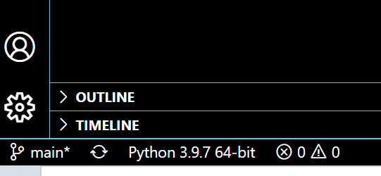

# gdv-WiSe2021_22
Exercises for course "Grafische Datenverarbeitung" in winter term 2021 at HS Furtwangen University. Please note that the lecture and the accompanying tutorials (Übung) is not defined to the end. All content here is tentative and will be adopted to the students' needs during the course.

# Prerequisites
- Install Python 3 from python.org
  - Version 3.9.7 is recommended, Python 3.10 does not work (yet)
  - Test which version is installed on your machine with `python --version` in the terminal
    - Ensure that the correct version is used in the terminal as well as the selected interpreter: 
- Install pip from https://pip.pypa.io/en/stable/installation/
  - Ensure that a version newer than 19.3 is installed

## Further Python ressources
If you are not familiar with Python, check out the following tutorials:
- https://www.python.org/about/gettingstarted/ 
- https://docs.python.org/3/tutorial/
- https://code.visualstudio.com/docs/python/python-tutorial

## VS Code
The code is all developed using VS Code. You can use any IDE, but VS Code will be used in the lecture.
- Install VS Code from https://code.visualstudio.com/

---
# Installing OpenCV
- Install opencv as pip module opencv-python as explained on https://pypi.org/project/opencv-python/ (Main modules should be enough for the beginning)

| Windows         | MacOS     | Linux |
|--------------|-----------|------------|
|py -m pip install opencv-python|python -m pip install opencv-python|python -m pip install opencv-python|

⚠ Note that there is no need to install OpenCV from opencv.org

⚠ Ensure that Python 3.9.7 is used as mentioned above.

See https://docs.opencv.org/master/d0/de3/tutorial_py_intro.html for further help on other systems.

---
# Helpful ressources

## Python
You can use https://docs.python.org/3/ as a starting point and the [Library Reference](https://docs.python.org/3/library/index.html) or the [Language Reference](https://docs.python.org/3/reference/index.html) should contain all the needed information.

## OpenCV reference
See https://docs.opencv.org/4.5.3/ for the OpenCV code reference. Here, all OpenCV methods are explained. If you want to know about parameters and flags, this is the page to look them up. 

## NumPy
OpenCV uses NumPy ndarrays as the common format for data exchange. It can create, operate on, and work with NumPy arrays. For some operations it makes sense to import the NumPy module and use special functions provided by NumPy. Other libraries like TensorFlow and SciPy also use NumPy. See https://numpy.org/doc/stable/reference/index.html for the API reference.

## Other tutorials
- [Tech with Tim: OpenCV Python Tutorials](https://www.youtube.com/watch?v=qCR2Weh64h4&list=PLzMcBGfZo4-lUA8uGjeXhBUUzPYc6vZRn)
- [freeCodeCamp.org -OpenCV Course - Full Tutorial with Python](https://www.youtube.com/watch?v=oXlwWbU8l2o) (not yet watched)

---
# Tutorials

## Tutorial #1
Load, resize and rotate an image. And display it to the screen.
- [empty code](./GDV_tutorial_01_empty.py)
- [complete code](./GDV_tutorial_01.py)

## Tutorial #2
Direct pixel access and manipulation. Set some pixels to black, copy some part of the image to some other place, count the used colors in the image
- [empty code](./GDV_tutorial_02_empty.py)
- [complete code](./GDV_tutorial_02.py)

## Tutorial #3
Show camera video and mirror it.
- [empty code](./GDV_tutorial_03_empty.py)
- [complete code](./GDV_tutorial_03.py)

## Tutorial #4
Loading a video file and mirror it.
- [empty code](./GDV_tutorial_04_empty.py)
- [complete code](./GDV_tutorial_04.py)

